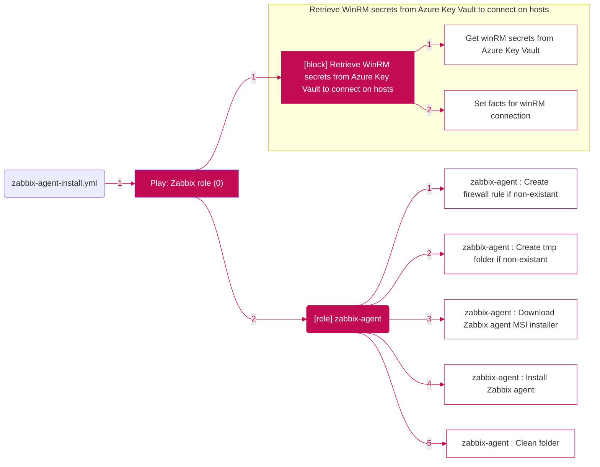

```mermaid
%%{ init: { "flowchart": { "curve": "bumpX" } } }%%
flowchart LR
	%% Start of the playbook 'zabbix-agent-install.yml'
	playbook_57cbfca6("zabbix-agent-install.yml")
		%% Start of the play 'Play: Zabbix role (0)'
		play_8d462916["Play: Zabbix role (0)"]
		style play_8d462916 fill:#c10b53,color:#ffffff
		playbook_57cbfca6 --> |"1"| play_8d462916
		linkStyle 0 stroke:#c10b53,color:#c10b53
			%% Start of the block 'Retrieve WinRM secrets from Azure Key Vault to connect on hosts'
			block_c65b2a08["[block] Retrieve WinRM secrets from Azure Key Vault to connect on hosts"]
			style block_c65b2a08 fill:#c10b53,color:#ffffff,stroke:#c10b53
			play_8d462916 --> |"1"| block_c65b2a08
			linkStyle 1 stroke:#c10b53,color:#c10b53
			subgraph subgraph_block_c65b2a08["Retrieve WinRM secrets from Azure Key Vault to connect on hosts "]
				pre_task_a5fd149f[" Get winRM secrets from Azure Key Vault"]
				style pre_task_a5fd149f stroke:#c10b53,fill:#ffffff
				block_c65b2a08 --> |"1"| pre_task_a5fd149f
				linkStyle 2 stroke:#c10b53,color:#c10b53
				pre_task_ebb7001d[" Set facts for winRM connection"]
				style pre_task_ebb7001d stroke:#c10b53,fill:#ffffff
				block_c65b2a08 --> |"2"| pre_task_ebb7001d
				linkStyle 3 stroke:#c10b53,color:#c10b53
			end
			%% End of the block 'Retrieve WinRM secrets from Azure Key Vault to connect on hosts'
			%% Start of the role 'zabbix-agent'
			play_8d462916 --> |"2"| role_bb2e2788
			linkStyle 4 stroke:#c10b53,color:#c10b53
			role_bb2e2788("[role] zabbix-agent")
			style role_bb2e2788 fill:#c10b53,color:#ffffff,stroke:#c10b53
				task_4e67efbc[" zabbix-agent : Create firewall rule if non-existant"]
				style task_4e67efbc stroke:#c10b53,fill:#ffffff
				role_bb2e2788 --> |"1"| task_4e67efbc
				linkStyle 5 stroke:#c10b53,color:#c10b53
				task_43e88823[" zabbix-agent : Create tmp folder if non-existant"]
				style task_43e88823 stroke:#c10b53,fill:#ffffff
				role_bb2e2788 --> |"2"| task_43e88823
				linkStyle 6 stroke:#c10b53,color:#c10b53
				task_f8922f34[" zabbix-agent : Download Zabbix agent MSI installer"]
				style task_f8922f34 stroke:#c10b53,fill:#ffffff
				role_bb2e2788 --> |"3"| task_f8922f34
				linkStyle 7 stroke:#c10b53,color:#c10b53
				task_1a1eba7e[" zabbix-agent : Install Zabbix agent"]
				style task_1a1eba7e stroke:#c10b53,fill:#ffffff
				role_bb2e2788 --> |"4"| task_1a1eba7e
				linkStyle 8 stroke:#c10b53,color:#c10b53
				task_ed84fcd8[" zabbix-agent : Clean folder"]
				style task_ed84fcd8 stroke:#c10b53,fill:#ffffff
				role_bb2e2788 --> |"5"| task_ed84fcd8
				linkStyle 9 stroke:#c10b53,color:#c10b53
			%% End of the role 'zabbix-agent'
		%% End of the play 'Play: Zabbix role (0)'
	%% End of the playbook 'zabbix-agent-install.yml'
```
